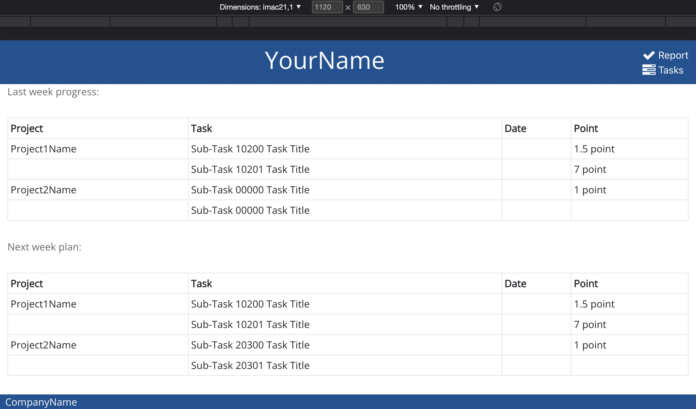

<div id="top"></div>

<!-- PROJECT LOGO -->
<br />
<div align="center">
  <a href="https://github.com/yuzukicat/auto-weekly-report">
    
  </a>

  <h3 align="center">auto-weekly-report</h3>

  <p align="center">
    A tool auto generating weekly-report according to your daily activities and easily assign tasks to part-time staff, saving your time editing powerpoint or google slide when adjusting styles with stupid right-click menu.
    <br />
    <a href="https://github.com/yuzukicat/auto-weekly-report/issues">Report Issue</a>
    ·
    <a href="https://github.com/yuzukicat/auto-weekly-report/pulls">Pull Request</a>
  </p>
</div>

<!-- TABLE OF CONTENTS -->
<details>
  <summary>Table of Contents</summary>
  <ol>
    <li>
      <a href="#about-the-project">About The Project</a>
      <ul>
        <li><a href="#built-with">Built With</a></li>
      </ul>
    </li>
    <li>
      <a href="#getting-started">Getting Started</a>
      <ul>
        <li><a href="#prerequisites">Usage</a></li>
      </ul>
    </li>
    <li><a href="#contributing">Contributing</a></li>
    <li><a href="#contact">Contact</a></li>
    <li><a href="#acknowledgments">Acknowledgments</a></li>
  </ol>
</details>

<!-- ABOUT THE PROJECT -->
## About The Project

[![auto-weekly-report][product-screenshot]](/src/assets/about-the-project.png)

<p align="right">(<a href="#top">back to top</a>)</p>

### Built With

* [nodejs](https://nodejs.org/en/)
* [npm](https://www.npmjs.com/package/npm)
* [yarn](https://yarnpkg.com/)
* [react](https://reactjs.org/)
* [create-react-app](https://create-react-app.dev/)
* [bootstrap](https://getbootstrap.com/)
* [reactstrap](https://reactstrap.github.io/)
* [react-popper](https://popper.js.org/react-popper/)
* [font-awesome](https://fontawesome.com/)
* [bootstrap-social](https://lipis.github.io/bootstrap-social/)
* [react-router-dom](https://reactrouter.com/)
* [redux]
* [react-redux]
* [@reduxjs/toolkit]

<p align="right">(<a href="#top">back to top</a>)</p>

<!-- GETTING STARTED -->
## Getting Started

### Usage

* Use a CLI like **zsh** or **konsole**.
* In sudo mode:
```sh
git clone https://github.com/yuzukicat/auto-weekly-report.git
npm install --g yarn
chmod -R 777 auto-weekly-report
cd auto-weekly-report
yarn
yarn start
```

* Use a Text Editor like **Code OSS**.
* Edit **YourName** in:
```sh
src/components/HeaderComponents
```

* Edit **CompanyName** in:
```sh
src/components/FooterComponents
```

* Edit **Your Weekly Report** in:
```sh
src/state
```

<p align="right">(<a href="#top">back to top</a>)</p>

<!-- CONTRIBUTING -->
## Contributing

1. Clone the Project
2. Create your Feature Branch (`git checkout -b feature/AmazingFeature`)
3. Commit your Changes (`git commit -m 'Add some AmazingFeature'`)
4. Push to the Branch (`git push origin feature/AmazingFeature`)
5. Open a Pull Request

<p align="right">(<a href="#top">back to top</a>)</p>

<!-- CONTACT -->
## Contact

Yuzuki.Cat - yuzuki.cat@kamisu66.com

<p align="right">(<a href="#top">back to top</a>)</p>

<!-- ACKNOWLEDGMENTS -->
## Acknowledgments

Please share useful links here for reference.

* [recoil](https://recoiljs.org/)

<p align="right">(<a href="#top">back to top</a>)</p>

<!-- MARKDOWN LINKS & IMAGES -->
<!-- https://www.markdownguide.org/basic-syntax/#reference-style-links -->
[product-screenshot]: /src/assets/about-the-project.png